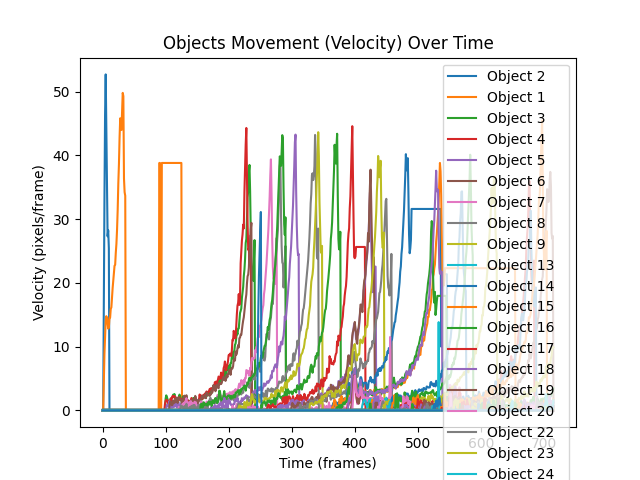

# Object Movement Detection and Tracking

This repository implements object detection and tracking using computer vision techniques, specifically leveraging **Kalman Filters** and the **SORT algorithm** (Simple Online and Realtime Tracking). The project aims to detect objects in a video feed and track their movement across frames and outputting a graph showing how active each object is over time. The current implementation handles single-class only. For multi-class, a class similarity check needs to be added to the tracker in order to avoid confusion between tracks that have different classes.

## Table of Contents
- [Overview](#overview)
- [Key Features](#key-features)
- [Installation](#installation)
- [Usage](#usage)
  - [Running Object Detection and Tracking](#running-object-detection-and-tracking)
- [File Structure](#file-structure)
- [Algorithm Details](#algorithm-details)
  - [Kalman Filter](#kalman-filter)
  - [SORT Algorithm](#sort-algorithm)
- [Results](#results)

## Overview
This project aims to provide a streamlined approach for detecting and tracking objects in video streams using computer vision. It uses **Kalman filters** to estimate the object's position and velocity while compensating for noisy measurements. The **SORT (Simple Online and Realtime Tracking)** algorithm is employed for real-time tracking of multiple objects.

In addition to tracking, the system outputs a video and a graph to visualizes the movement (activity) of tracked objects over time.

## Key Features
- Object detection in video streams.
- Real-time multi-object tracking using SORT algorithm.
- Kalman filter-based state estimation for each object (position and velocity).
- Visualization of object activity over time.
- Easily configurable for different video input sources.

## Installation
Clone the repository and launch container building, it will run automatically once the build is done. The container uses Ultralytics's latest image along with some additional packages that are specified in `requirement.txt` and are installed automatically.

```bash
git clone https://github.com/Rachelslh/Object-Movement-Detection-and-Tracking.git
cd Object-Movement-Detection-and-Tracking
sh docker.sh
```

## Usage

### Running Object Detection and Tracking
There's a config file under the src directory, in which you can specify the pretrained model you'd like from Ultralytics, class confidence threshold and the class you'd like to work with.

You can run the object detection and tracking on any video file by specifying the path to the input file and the output path in the config directly.

```bash
python infer.py
```

The program will process the video, apply object detection, and track the objects in real-time. Detected bounding boxes will be drawn around the objects of interest in blue, their positions and velocities will be tracked. The tracks' estimated bounding boxes are drawn in red. This is saved whithin the output video that will be written by default to `output.mp4`.

You'll also find a plot saved whithin the main directory under the name `Objects_movement.png`. The plot shows all the tracks' velocities (i thought about using displacement instead but velocity is also a proof of movement and is estimated directly by Kalman filters).

## File Structure

Here's the main file structure, excluding additional repo management tools as dockerfile and the pre-commit hook.

```bash
Object-Movement-Detection-and-Tracking/
│
├── data/                      # Contains sample video files and output data
├── src/                       # Source directory
│   ├── config.py              # configuration YAML file
    ├── model.py               # Yolo inference, SORT algorithm implementation, Kalman Filter implementation
│   └── mltypes.py             # Types defined as dataclasses to work with
├── data/                      # Contains sample video files and output data
└── README.md                  # Project description and usage
```

## Algorithm Details

### YOLO Inference

Using YOLO11m here for detection and classficiation, inference runs with one frame at a time to mimic behavior where the input comes from an RTSP, taking an average of 150ms per frame on an MPS(M1) device.

From the Ultralytics Yolov11 model results, it appears that Yolo11m has a good  precision/latency tradeoff, larger models aren't that far away in terms of precision but have a higher latency. Smaller models appear to have lower latency and lower precision values than the medium one (Yolo11m).

### Kalman Filter

The Kalman Filter is used for predicting the next position of each object based on its past state. The Kalman filter helps:

- Predict the next state of the object. I designed the state to be comprised of [center_x, center_y, area, aspect_ratio, velocity_x, velocity_y]. The area and aspect ratio are important to be defined in the state here as we're dealing with an entire object and not just a point in movement, this is needed to be able to predict a bounding box.
- Correct the prediction using the new measurements i.e. [center_x, center_y, area, aspect_ratio] that are retrieved from the new bounding box detection.

Noise and uncertainty covariance matrices are created by default using KalmanFilter from FilterPy package.

### SORT Algorithm

The SORT (Simple Online and Realtime Tracking) algorithm is used for multi-object tracking. It works by:

- Matching detected objects (bounding boxes) with the tracks' estimated bounding boxes based on IOU values and using linear assignment which is by default minimum weight matching, however, we are maximizing the cost (IOU) here. The assignement method uses The Jonker-Volgenant algorithm that supposed to be much faster than the famous Hungarian algorithm.
- Assigning unique IDs to each track.
- Handling the appearance and disappearance of objects over time: After matching, we are left with either some unmatched detections or unmatched tracks or even both. For unmatched detections, these are considered as new tracks that just appeared (Track initialization). For unmatched tracks, these are considered lost tracks (Track deletion) To extend the track's life in this case, can add some waiting time to enable track recovery.


### Additional Info

The code adheres to the rules of OOP, designed some ML-based types such as the bounding box, detection and track to help with the overall structure of the code.

## Results

Input video comes from [here](https://www.youtube.com/watch?v=Y1jTEyb3wiI).
Output video can be visualized [here](https://drive.google.com/file/d/1gyJCpnmVahOt4HVHXJZciFckhrnVa-5Y/view?usp=sharing). Used class confidence threshold of 0.40 for this one.

<p align="center">
  
</p>
